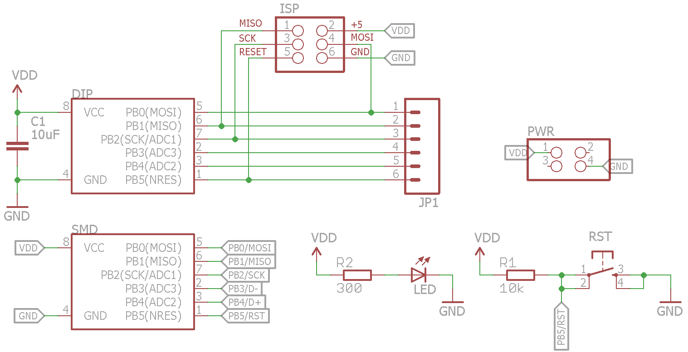
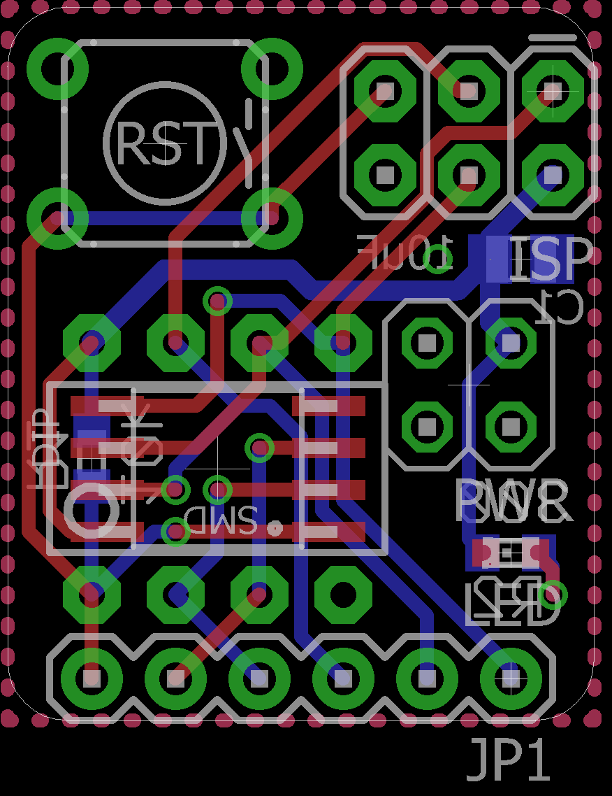

https://hackaday.io/project/6332-breadboard-widgets/log/19613-attiny-prog-board for more info.

Programming board suitable for ATtiny45/85 microcontrollers. Plugs into a breadboards power rails to minimize required space.
USB version pin compatible with uUSB breakout.

