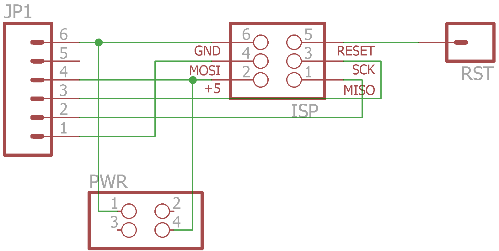
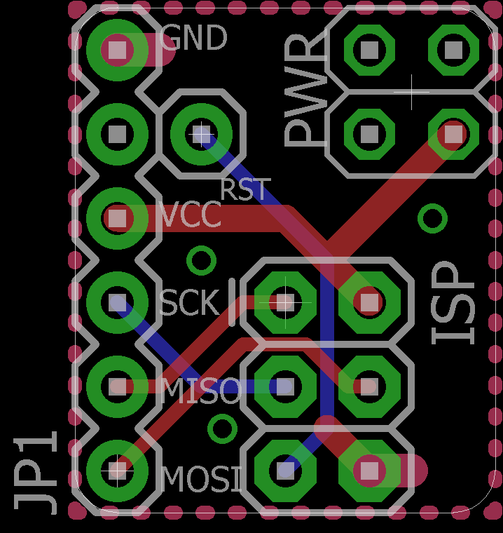
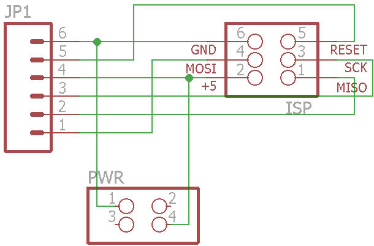
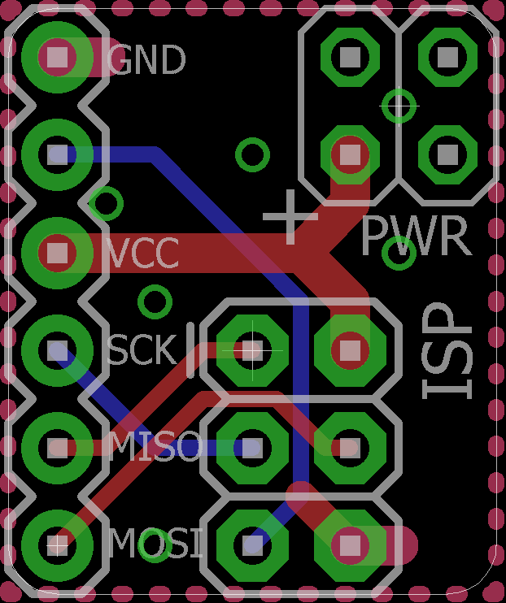
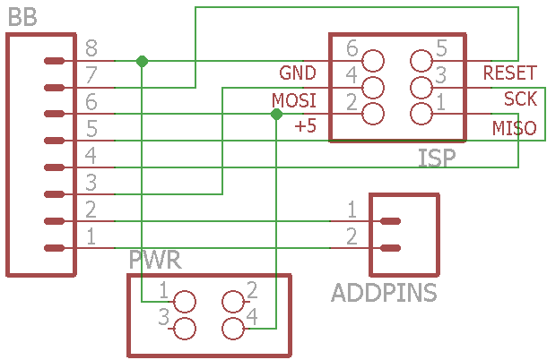
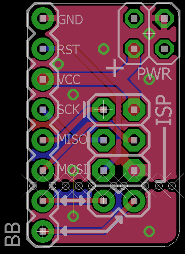

Simple ISP breakout. Order of pins corresponds to ATmega328 DIP so breakout can be plugged in next to it. Jumper wire required for RST. Also fits ATtiny45/85 with additional jumper for GND.
[**more info**](https://hackaday.io/project/6332-breadboard-widgets/log/19660-isp-breakout)

**v1**

**v1.1**

**v1.2**

Added two additional pins to ISP & breadboard headers to allow this board to be used as breakout for e.g. ESP-01's.

