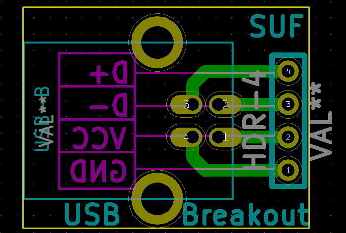
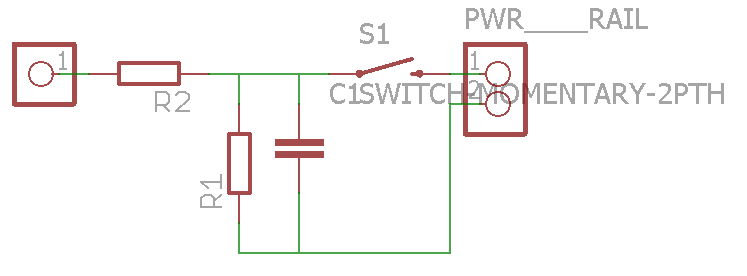
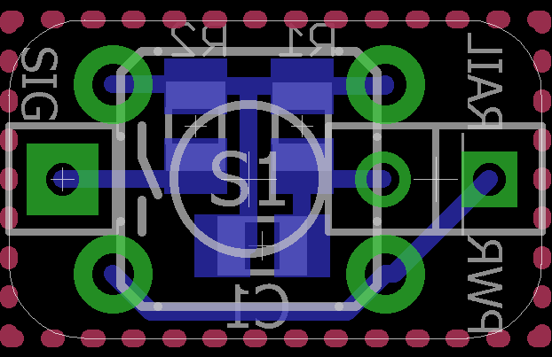
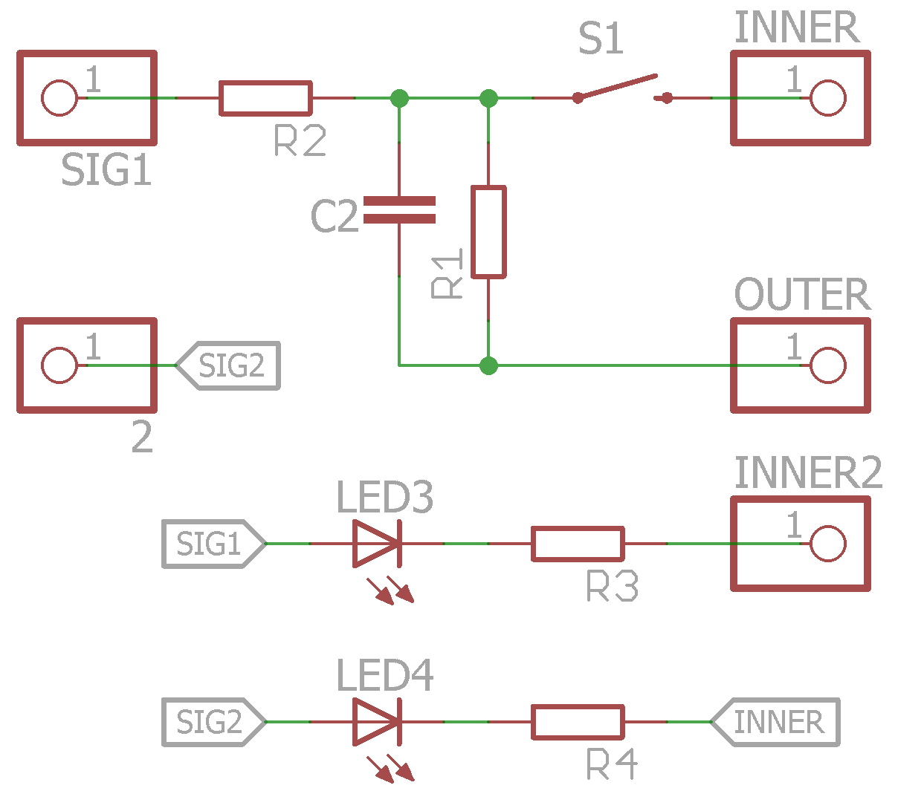
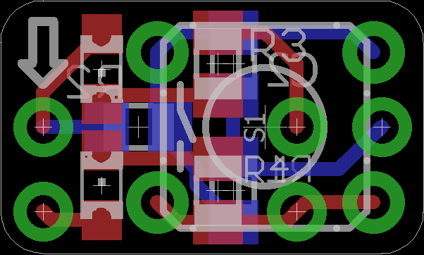

A collection of widgets/adapters/breakouts to make prototyping easier.
For more infos please see [**project page on HaD.io**](https://hackaday.io/project/6332-breadboard-widgets). A panel with a subset of these booards can also be ordered from the [**DirtyPCBs store**](http://dirtypcbs.com/view.php?share=9791&accesskey=ab0e86ffb8323f031e5f15a2c98e4056)

####ATtiny prog board
Programming board suitable for ATtiny45/85 microcontrollers. Plugs into a breadboards power rails to minimize required space.
USB version pin compatible with uUSB breakout.
[**more info**](https://hackaday.io/project/6332-breadboard-widgets/log/19613-attiny-prog-board)

#####Standard:

#####With USB:

####DBx breakout
Simple breakout for DA-15, DB/DE-9 & DE-15(VGA) connectors. DB-9 to be placed on DA-15 footprint. [**more info**](https://hackaday.io/project/6332/log/26554)

 

####ISP breakout
Simple ISP breakout. Order of pins corresponds to ATmega328 DIP so breakout can be plugged in next to it. Jumper wire required for RST. Also fits ATtiny45/85 with additional jumper for GND.
[**more info**](https://hackaday.io/project/6332-breadboard-widgets/log/19660-isp-breakout)

#####v1.2

Added two additional pins to ISP & breadboard headers to allow this board to be used as breakout for e.g. ESP-01's.

####MOSFET breakout
DPAK MOSFET breakout to be used as single channel PWM driver. Footprint should also fit SOT-223 package where pin 2 is internally connected to tab.
[**more info**](https://hackaday.io/project/6332-breadboard-widgets/log/21781-mosfet-breakout-for-pwm-driver)

 

####SMD LED breakout
Straight forward SMD LED breakout. See also [**revised button board that can be used as LED breakout**](https://github.com/stefan-lochbrunner/breadboard-widgets/tree/master/button)

#####single

#####multi

####SOIC/TSSOP-16 breakout & protoboard
Some variations on a SOIC-16 and TSSOP-16 breakout board.

####USB breakouts

#####uUSB breakout
Main functionality is to provide "VUSB circuitry" for AVR microcontrollers. Can also be used as generic uUSB breakout by shorting 68R resistor footprints or as breadboard power supply (supplying 5V).
[**more info**](https://hackaday.io/project/6332-breadboard-widgets/log/19615-uusb-breakout)

######v1
 

######v2
Allows for supplying different voltages by populating the bottom side with desired regulator. For 5V short solder jumper.

superseded by v3

######v3
Allows for supplying different voltages by populating the bottom side with desired regulator. The following modes are possible:

- Supply rail and Vcc pin with 5V directly from USB (regulator not populated, short all 3 pads of solder jumper)
- Supply regulator with 5V from USB which in turn supplies rail and Vcc pin (short center and top pad)
- Supply regulator from rail and get regulated voltage on Vcc pin (short center and bottom pad)

 

#####USB-B

####Audio breakouts
Breakout boards for 3.5mm TRS & RCA jacks. [**more info**](https://hackaday.io/project/6332-breadboard-widgets/log/21029-sufs-audio-breakouts)

Based on @sufzoli 's https://github.com/sufzoli/suf-electronics-breadboard

 

Combined both into single board to save PCB space.

 

####Button w/ pull resistor
[**more info**](https://hackaday.io/project/6332-breadboard-widgets/log/19614-button-w-pull-updown)

##### single button
Small board that incorporates a button and pull-resistor. Can be plugged into power rails. Depending on which side of a breadboard it is plugged in, acts as pull-up or pull-down. Optional footprints for low-pass filter for debouncing.

 

##### single button with SMD LED breakout
added over complicated LED breakout to utilize board space. Also added arrow to indicate pull direction.

 

####Negative voltage converter
Included files of @sufzoli 's [**voltage inverter**](https://github.com/sufzoli/suf-electronics-USB-INV-PM) here and remade in Eagle for coherency. [**more info**](https://hackaday.io/project/6332-breadboard-widgets/log/22127-sufs-negative-voltage-converter)

Based on ICL7660, inverts supply voltage.

 
