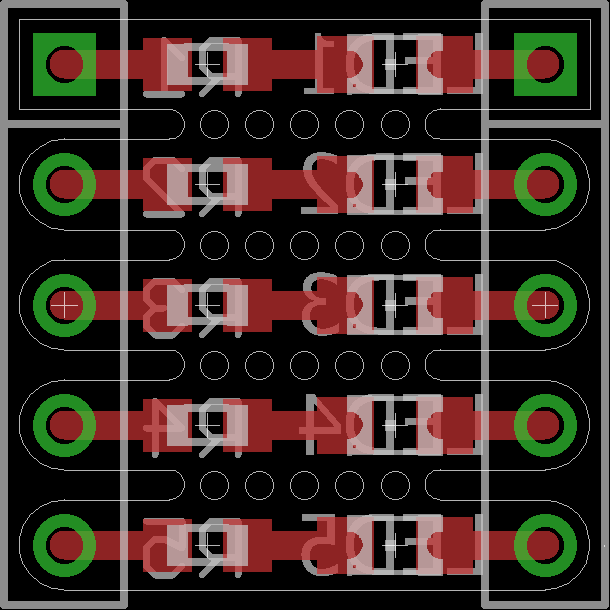

# SMD LED breakout
------------------

Straight forward SMD LED breakout. To be used between the inside of a breadboard and its power rails. [more info](https://hackaday.io/project/6332-breadboard-widgets/log/27568-1-5x-smd-led-breakout)

#### Single

#### Multi

