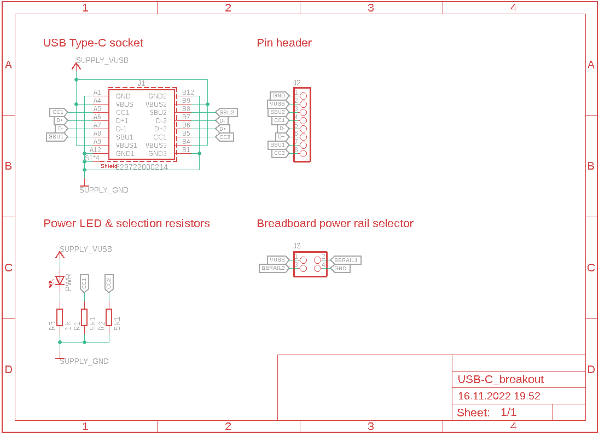
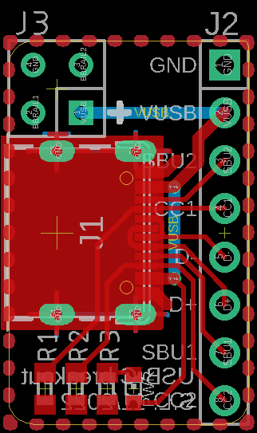

# USB 2.0 Type C breakout
-------------------------

USB-C breakout inspired by the [Adafruit USB Type C Breakout Board](https://github.com/adafruit/Adafruit-USB-C-Downstream-Breakout) with [breadboard power rail connector](https://hackaday.io/project/6332-breadboard-widgets/log/19631-pwr-thingy) and power indicator LED.

  

