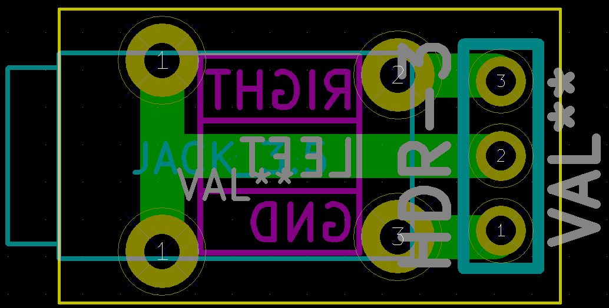
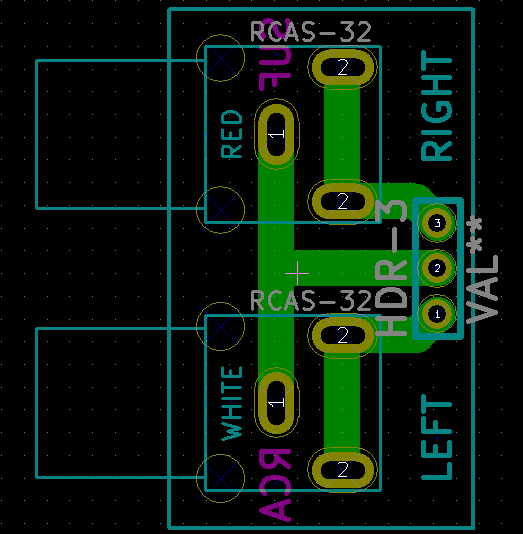
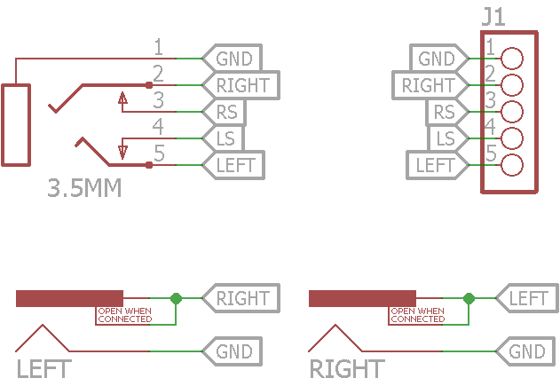

Breakout boards for 3.5mm TRS & RCA jacks. [**more info**](https://hackaday.io/project/6332-breadboard-widgets/log/21029-sufs-audio-breakouts)

Based on @sufzoli 's https://github.com/sufzoli/suf-electronics-breadboard

 

Combined both into single board to save PCB space.

 
